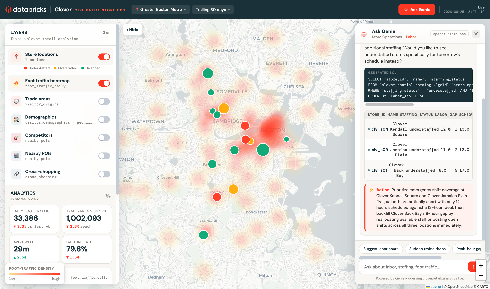

# Clover Geospatial Store Ops 🗺️

[](https://docs.databricks.com/en/dev-tools/databricks-apps/index.html)
[](https://docs.databricks.com/en/sql/language-manual/sql-ref-datatypes-geospatial.html)
[](https://docs.databricks.com/en/genie/index.html)
[](https://docs.databricks.com/en/machine-learning/foundation-models/index.html)
[](https://leafletjs.com/)

A geospatial store-operations cockpit that staffs retail labor to **real foot traffic** and flags **sudden localized drops**, built end to end on Databricks: governed geospatial data in Unity Catalog, natural-language analytics with Genie, and a next-best-action from the Foundation Model API, delivered as a Databricks App.



> Clover is a fictional retailer. The data is synthetic and generated deterministically; nothing here represents a real company.

## 🏪 Industry Use Case

**Retail Store Operations, specifically labor optimization.** Store managers and operations leaders see their fleet on a live map, toggle data layers, and watch the analytics panel recompute KPIs for exactly what is in the current viewport as they pan and zoom. Every store is scored against a target of **165 visits per labor-hour**, so the app surfaces which locations are understaffed or overstaffed for tomorrow's forecast and where foot traffic has suddenly dropped week over week, a signal to pivot hours in near real time.

### Why geospatial labor optimization matters

Labor is one of the largest controllable costs in retail, and most chains still schedule on stale averages rather than current, localized demand. Joining foot-traffic, trade-area, and competitive signals geospatially, then comparing scheduled hours to forecast demand, lets operators:

- Right-size staffing per store against real demand
- Reallocate hours from overstaffed to understaffed locations
- React to sudden localized drops (weather, construction, a competitor opening) before a shift is wasted

### The Databricks approach

- **Geospatial analytics in Unity Catalog**: latitude/longitude, H3 cells, and `geometry` types for trade areas, cross-shopping, and nearby points of interest
- **A governed medallion model** (bronze to gold) where every map layer is a live, governed table
- **AI/BI Genie** for natural-language SQL over the same governed tables
- **Foundation Model API** (`databricks-claude-sonnet-4-6`) for the next-best-action insight
- **Databricks Apps** for delivery, with **on-behalf-of-user auth** so access control is enforced as the viewer

## 🧭 What It Does

- Plots the store fleet (Greater Boston) on an interactive Leaflet map with pins colored by staffing status
- Toggleable layers: store locations, foot-traffic heatmap, competitors, nearby POIs, cross-shopping flows
- In-viewport KPI panel that recomputes on every pan/zoom: daily foot traffic, trade-area visitors, average dwell, capture rate, plus week-over-week deltas and traffic-weighted demographics
- Per-store drill-down: staffing status, labor gap, trailing traffic delta, recommended hours
- **Ask Genie** sidebar: ask labor and traffic questions in plain language and get back the generated SQL, a results table, and a one-line ⚡ next-best-action

## 🏗️ Project Structure

```
frontend/src/      React + Leaflet (Vite build)
  App.jsx          Cockpit shell: top bar, layer rail, map column, drill-down
  map.js           Leaflet build, layer toggles, in-view recompute
  geniePanel.jsx   Live Ask Genie panel (SQL, table, action, markdown render)
  api.js           Fetch wrappers for /api/*
frontend/dist/     Compiled static bundle (gitignored; build before deploy)
backend/           FastAPI application
  main.py          Entry point; routes; mounts frontend/dist; OBO token dependency
  layers.py        /api/bootstrap and /api/layers/* (gold queries to design contract)
  analytics.py     In-viewport KPI computation (pure, unit-tested)
  genie.py         /api/genie/ask (Genie Conversation API proxy)
  action.py        /api/action (next-best-action via Foundation Model API)
  db.py            SQL warehouse access via the Statement Execution API
data/              Gold build (run offline against the SQL warehouse)
  config.py        Catalog/schema constants, anchor date, target ratio, thresholds
  generate_fleet.py  Deterministic synthetic fleet + daily series + demographics
  load_gold.py     Builds gold.locations / foot_traffic_daily / labor_schedule
  build_forecast.sql  ai_forecast (DOW-seasonal fallback) -> gold.store_forecast
  build_gold.sql   gold.store_ops + analytic views
  build_views.py   Runs the forecast + gold SQL on the warehouse
genie/             Genie space definition + build script
```

## 🗄️ Data: Bronze to Gold

Source data lives in `clover_spatial_catalog.bronze` (read-only). The app reads a governed **gold** layer built on top of it. Bronze covers 3 real stores; the gold build synthesizes 12 additional Greater Boston stores (deterministic, seed 42) so the fleet, labor model, and map are demo-ready.

```
clover_spatial_catalog.bronze          clover_spatial_catalog.gold
---------------------------------------------------------------------
locations                       -->    locations            (15 stores)
foot_traffic_daily              -->    foot_traffic_daily   (real + synthetic)
visitor_origins                 -->    labor_schedule       (synthesized hours)
visitor_demographics            -->    store_forecast       (ai_forecast / fallback)
cross_shopping                  -->    store_ops            (staffing + traffic delta)
nearby_pois                     -->    v_traffic_anomalies, v_daypart_coverage,
geo_zips / geo_counties                v_trade_areas, v_demographics,
                                       v_cross_shopping, v_nearby_pois
```

`gold.store_ops` is the cockpit spine: `forecast_visits`, `ideal_hours = round(forecast_visits / 165)`, `labor_gap = ideal_hours - scheduled_hours`, `staffing_status` (understaffed if gap >= +8, overstaffed if <= -8, else balanced), and `traffic_delta_pct` (trailing-7-day vs prior-7-day mean visits). Gold views are owned by the deployer, so Unity Catalog ownership chaining lets a reader query gold without direct grants on bronze.

### Rebuild gold

```bash
# From the project root, with the workspace CLI profile configured
python -m data.load_gold      # build gold.locations / foot_traffic_daily / labor_schedule
python -m data.build_views    # build store_forecast (ai_forecast), store_ops, analytic views
```

### Rebuild the Genie space

```bash
python -m genie.build_genie_space   # create-or-update the "Clover Store Ops" space over gold
```

The space ID is written to `genie/.space_id` and read by the app via `GENIE_SPACE_ID`.

## 🔐 Authentication (on-behalf-of-user)

Every Unity Catalog, Genie, and serving-endpoint call runs as the **viewing user**, not the app service principal:

- Databricks Apps authenticate the viewer and inject an `X-Forwarded-Access-Token` header into each request, scoped to the app's `user_api_scopes` (`sql`, `serving.serving-endpoints`, `dashboards.genie`).
- A FastAPI dependency reads that header and threads the token through `layers`, `genie`, and `action` into the per-request `WorkspaceClient` (`auth_type="pat"`, with the bare `DATABRICKS_HOST` normalized to `https://`).
- Queries therefore use the viewer's privileges. This is the supported data path because the app service principal is not granted catalog access. A request with no forwarded token (for example a background job) fails with a Unity Catalog permission error by design.

## 🚀 Build and Deploy

```bash
# 1. Build the frontend
cd frontend && npm install --prefer-offline --legacy-peer-deps && npm run build && cd ..
```

**The built `frontend/dist/` must land in the workspace.** It is gitignored, and `databricks sync` silently drops it, so stage a clean directory (no .gitignore) and use `databricks workspace import-dir`. Do **not** ship `frontend/node_modules`, `package.json`, or `src` (the Apps build container auto-detects `package.json`, runs `npm install`, and times out).

```bash
# 2. Stage runtime files (app.yaml, requirements.txt, backend/, data/, frontend/dist/)
STAGE=$(mktemp -d)
cp app.yaml requirements.txt "$STAGE/"
rsync -a --exclude='__pycache__' --exclude='*.pyc' --exclude='tests/' backend/ "$STAGE/backend/"
rsync -a --exclude='__pycache__' --exclude='*.pyc' --exclude='tests/' data/ "$STAGE/data/"
rsync -a frontend/dist/ "$STAGE/frontend/dist/"
WS="/Workspace/Users/<you>/clover-geospatial"
databricks workspace import-dir "$STAGE" "$WS" --overwrite

# 3. Attach resources + user scopes (apps deploy does NOT apply app.yaml resources)
databricks apps update clover-geospatial --json @resources.json

# 4. Deploy
databricks apps deploy clover-geospatial --source-code-path "$WS"
```

`resources.json` holds the SQL warehouse + serving-endpoint grants AND the `user_api_scopes`; applying it without the scopes block resets them to null (the update is a full replace).

## 🔧 Configuration

| Variable | Purpose | Source |
|---|---|---|
| `DATABRICKS_WAREHOUSE_ID` | SQL warehouse for gold queries + `ai_forecast` | `app.yaml` |
| `GENIE_SPACE_ID` | Genie space the Ask panel calls | `app.yaml` |
| `SERVING_ENDPOINT` | Foundation Model for the next-best-action | `app.yaml` |
| `GOLD_SCHEMA` | Gold schema name (`gold`) | `app.yaml` |
| `DATABRICKS_HOST` / `DATABRICKS_CLIENT_ID` / `DATABRICKS_CLIENT_SECRET` | App SP identity | injected by Databricks Apps |

Staffing tunables live in `data/config.py`: `TARGET_VISITS_PER_HOUR` (165), `STAFFING_GAP_THRESHOLD` (8), `CLOVER_SEED` (42), `ANCHOR_DATE`.

## 🧪 Tests

```bash
python -m pytest data/tests backend/tests -v
```

Covers the deterministic generator, the gold contract (live integration), the in-view analytics math, the layer data contract, the API routes, and the action dash-sanitizer.

## 📜 License

Licensed under the Apache License, Version 2.0. See [`LICENSE`](LICENSE).

## 🆘 Support

This project is provided for exploration and demonstration only. It is not formally supported by Databricks under any Service Level Agreement (SLA), is provided AS-IS, and carries no guarantees of any kind. Please do not file a Databricks support ticket for issues arising from its use. Any issues discovered should be filed as GitHub Issues on this repository; they will be reviewed as time permits, but there are no formal SLAs for support.

&copy; 2026 Databricks, Inc. All rights reserved.
